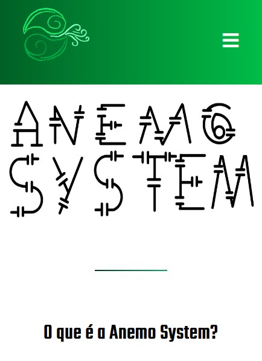

<h1>Anemo System's Site 🍃</h1>
The idea of the site is very simple!<br>
It's where we would update and inform our users about news of our games and company, including <b>Dr. Octopus School</b><br><br>

<h2> Site Elements </h2>
The site is separated in 5 elements, wich are these:<br>


 ```diff
  # 'Sobre' means 'About', 'Produções' means 'Productions', 'Redes Sociais' means 'Social Media', 
  # 'Notícias' means 'News'(but we refer that page as 'Blog') and 'Time' means 'Team'
 ```

The main page, alongside the tab "About", introduced our company and the "Productions" tab is focused on apresetating our others projects/projects of our members. The "Social Media" tab links to the footer. <s>Even tho we actually don't have any of those medias lol</s><br><br>

Then there's the "Blog" page, where we would link to our blogspot and talk about news and updates of our projects<br>
Even if our "Blog" page didn't worked as espected, it still works!<br><br>

For last, we have the "Team" page, who's intended to introduce all members of our team and talk about what we made, alongside some 'curiosities'.<br><br>

<h2> Compability </h2>
We worked a lot to make the best experience to all visitors of the site, so we made it most responsive as we could!<br>
The site even has some exclusivities between different platforms! (For example: The moving logo on the computer version)<br><br>
<p align="center">
  <br>
<s>They aren't that different tho, just some little things</s><br><br>
</p>

<h2> Dr. Octopus School Page </h2>
'Dr. Octopus School' has his own page, wich is focused on present all elements of the game (wich are followed by images)
and explain to the viewer how those elements impacted the game! You should give it a look!<br><br>

<h3>See about our game here: <a href="https://github.com/GGGCD-TCC/dr-octopus-school"> Dr. Octopus Shcool</a></h3><br>
 <a href="https://gggcd-tcc.github.io/anemo-system-website/">
 
 </a>
